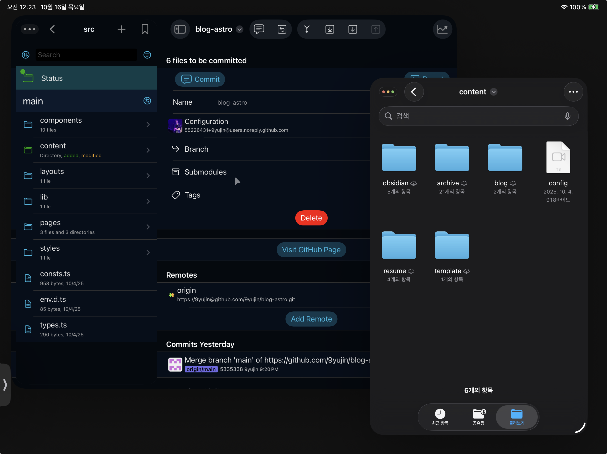

블로그를 astro를 사용하는 개인 페이지로 옮겼다. 마지막 글이 네이버와 티스토리에서 각각 23년 5월, 23년 10월이니까, 거의 2년정도 블로그를 놓고 있었다 (쓰다 말고 임시저장해둔건 많다!). 네이버나 티스토리에 글을 쓰는건 약간 전월세로 들어온 집에 돈쓰는 느낌 같다고 할까. 멋진 가구도 들여놓고, 벽에 못도 박아서 멋진 그림도 걸어두려면 아무래도 내 집인게 좋다.

이것저것 알아보다가 [Astro](https://astro.build/)를 선택했다. 
- 자바스크립트 기반이다. Gatsby도 고민해봤는데, 프레임워크 자체가 유지보수가 잘 안되고 있는 느낌이었다.
- 글을 작성하고 배포하는게 편리하다.
- [마음에 드는 템플릿](https://astro-nano-demo.vercel.app/)을 발견했다! 여기저기 뜯어고치니 마음에 쏙 든다.
- 빠르고 SEO 챙기기 편하다.

#### Obsidian
맥과 아이패드에서 모두 글을 작성하고 배포할 수 있어야 했다. 맥과 아이패드에서 쓰던 글이 동기화가 되어야 했다. 노션을 CMS처럼 사용해볼까 했지만 최대한 생각보다 건들게 많았다. 옵시디언은 로컬 파일 기반인게 좋았다. obsidian sync를 구독하면 여러 기기에서 동기화할 수 있다.

Astro는  `---` 로 감싸지는 Frontmatter를 가지고 마크다운 콘텐츠의 메타데이터로 사용하는데, 옵시디언에서도 이쁘게 지원하는 형식이었다. 옵시디언에 템플릿으로 만들어놓고 빠르게 새 글을 시작할 수 있다. 여러모로 마음에 드는 조합이다. 

#### 배포
프로젝트의 content 디렉토리를 곧바로 obsidian 볼트로 사용하면 글을 작성하고 바로 커밋해 글을 발행할 수 있다. netlify 배포가 편리하다. 기본 도메인이 못생긴 건 상당히 아쉬운 점.

`blog preview`, `blog push`

#### Working copy
아이패드에서는 배포를 어떻게 하는가. 아이패드에서도 working copy라는 앱을 이용해서 github와 연결할 수 있다. 무려 6만원을 내면!

앱에서 설정을 잘 하고 clone을 받으면 '내 파일'에서 외부 저장소 연결한것 처럼 새로운 폴더가 생긴다. 그 위치에서 파일을 수정한 뒤에 다시 working copy 앱에서 커밋과 푸시가 가능하다.

직접 obsidian 디렉토리에 있는 폴더를 working copy 디렉토리로 복사 붙여넣기 하는 과정이 필요하다. PC와 동일하게 (git 클론받은) content 디렉토리를 옵시디언 볼트로 설정하려고 했는데, 아이패드 앱에서는 그게 안됐다. 처음에 상상한대로 완벽하게 되지는 않아 아쉽다.